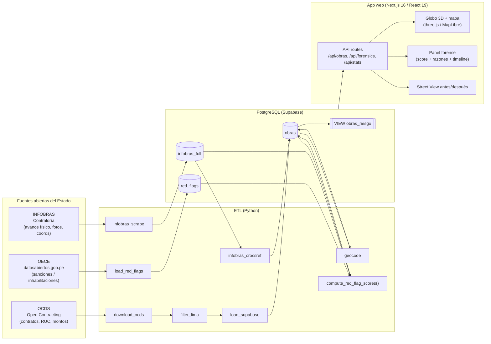
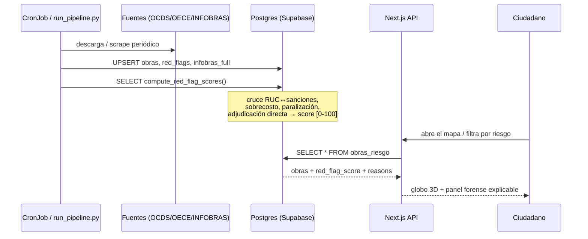
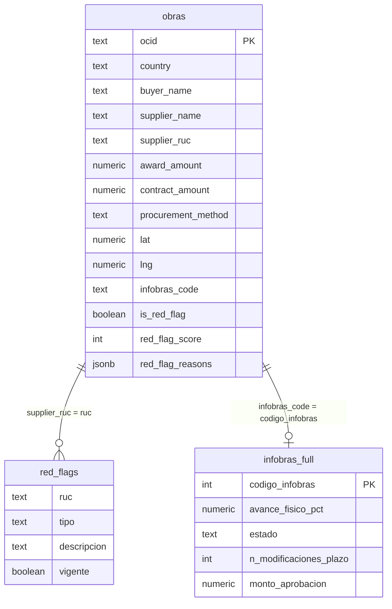
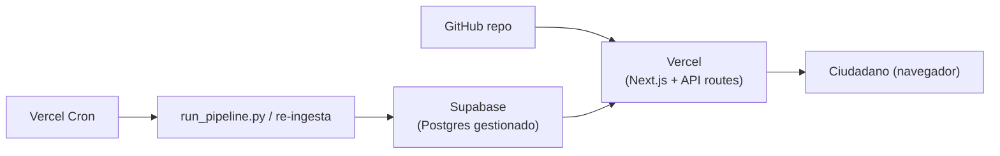

# Arquitectura — Transparentape v2

> Mapa abierto de obras públicas del Estado peruano con detección automática de
> irregularidades. Cruza datos abiertos fragmentados (OCDS, OECE, INFOBRAS) y los
> pone sobre un mapa que cualquier ciudadano entiende, marcando automáticamente
> las obras con señales de riesgo.

## 1. Vista de módulos

## 2. Flujo de datos (ingesta → riesgo → ciudadano)

## 3. Modelo de datos (núcleo)

## 4. Detección de irregularidades (scoring)

El corazón del proyecto. `compute_red_flag_scores()` (ver
[`supabase/migrations/06_red_flag_score.sql`](../supabase/migrations/06_red_flag_score.sql))
calcula un score ponderado y **explicable** por obra:

| Señal | Peso | Fuente |
|---|---|---|
| Contratista sancionado (RUC en OECE) | 35 | OECE |
| Inhabilitación judicial vigente | +15 | OECE |
| Sobrecosto (contrato > adjudicado +15%) | 25 | OCDS |
| Obra paralizada (avance bajo + estado) | 20 | INFOBRAS |
| Obra vencida (fin programado pasó, avance < 100%) | 15 | INFOBRAS |
| Adjudicación directa (sin competencia) | 10 | OCDS |
| ≥3 modificaciones de plazo | 10 | INFOBRAS |
| Contratista recurrente (≥10 adjudicaciones) | 10 | OCDS |

> Cada obra guarda `red_flag_reasons` (JSONB) con el desglose, para mostrarle al
> ciudadano **por qué** está marcada — no es una caja negra.

## 5. Despliegue

