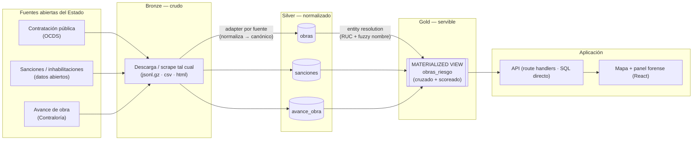
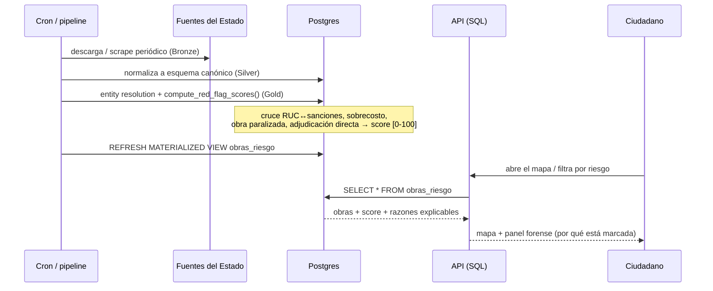
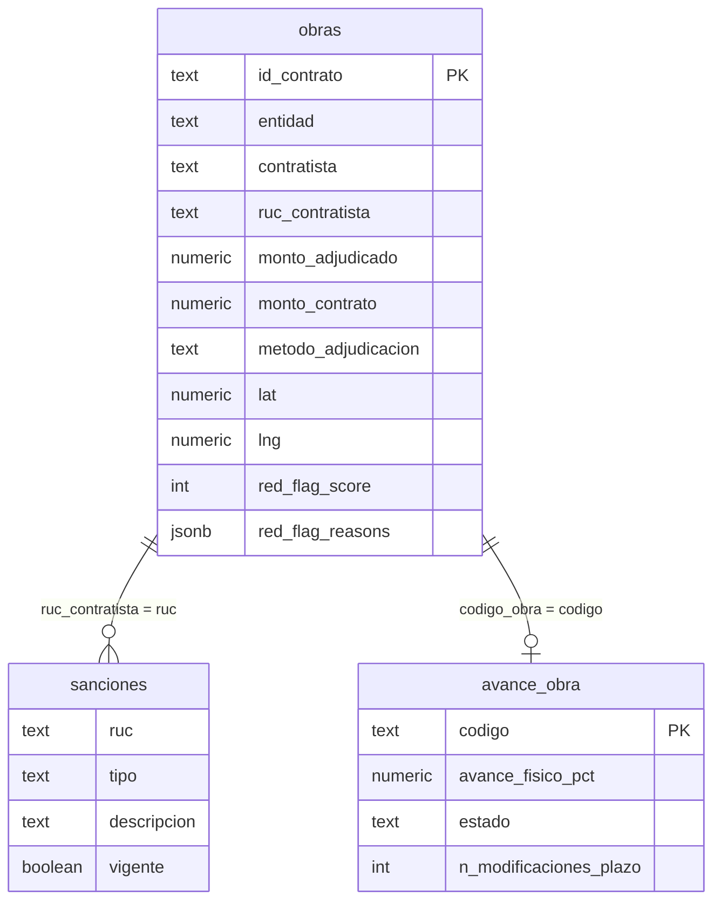
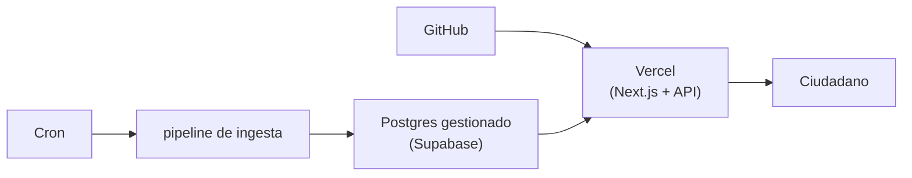

# Arquitectura — Vigía

> En un mar de datos públicos opacos, **Vigía** otea desde lo alto y avista los
> arrecifes ocultos —las irregularidades en la contratación del Estado— antes de
> que el ciudadano naufrague en la burocracia.

Plataforma que **scrapea, cruza y vuelve legibles** los datos abiertos del Estado
peruano sobre contratación y obras públicas, marcando automáticamente las obras
con señales de riesgo.

---

## 1. Estilo arquitectónico

**Lakehouse Medallion + Postgres analítico** (arquitectura por capas).

- **Ingesta** desacoplada del *serving*: un re-scrape roto nunca tumba lo que ve
  el ciudadano.
- **Lógica de negocio centralizada y auditable** en la base de datos (scoring de
  riesgo como función SQL, con su desglose explicable).
- **API delgada y tipada**; frontera *server / client* clara en el front.
- **Ports & adapters solo donde es honesto**: en la ingesta, un *adapter* por
  fuente del Estado traduce un formato externo sucio a un modelo canónico. No se
  etiqueta la app entera como "hexagonal", porque la lógica de dominio vive a
  propósito en Postgres (decisión de [ADR 0002](adr/0002-ports-adapters-solo-ingesta.md)).

## 2. Capas (Medallion)



| Capa | Qué hace | Tecnología | Por qué (honesto / jury-proof) |
|---|---|---|---|
| **Bronze (ingesta)** | 1 *adapter* por fuente: descarga/scrape → guarda crudo. Idempotente, re-ejecutable por cron. | Python · requests · BeautifulSoup · ijson | El dato del Estado es heterogéneo y sucio; aislar cada formato externo en su adapter evita acoplar el resto del sistema. Batch + cron, **no** streaming, porque el dato público cambia a diario, no por segundo. |
| **Silver (normalización)** | Modela el crudo a un esquema canónico normalizado. | PostgreSQL | Una sola forma canónica permite cruzar fuentes que escriben la misma entidad de formas distintas. |
| **Gold (analítica)** | *Entity resolution* por RUC + nombre (`pg_trgm`), **scoring de riesgo como función SQL**, expuesto como **vista materializada**. | PostgreSQL (`pg_trgm`, `tsvector`) | Cruzar por RUC es un problema de JOIN + fuzzy matching → Postgres lo hace nativo, sin compute extra. La lógica en la base es auditable y reproducible. |
| **API** | Route handlers delgados, tipados, cacheados; reads pesados con `statement_timeout`. | Next.js Route Handlers · `pg` | SQL directo da control fino para queries forenses y el read grande del mapa. Un API separado duplicaría el despliegue y subiría el riesgo. |
| **Presentación** | Shell RSC + islas cliente (mapa), panel forense (score + razones). | React · MapLibre / three.js | RSC para lo estático/KPIs; cliente solo donde hay interacción. |

## 3. Flujo de datos (ingesta → riesgo → ciudadano)



## 4. Modelo de datos (núcleo)



## 5. Detección de irregularidades (scoring explicable)

Una función SQL calcula un **score ponderado [0-100]** por obra y guarda el
desglose en `red_flag_reasons` (JSONB), para mostrarle al ciudadano **por qué**
una obra está marcada — no es una caja negra.

| Señal | Peso | Fuente |
|---|---|---|
| Contratista sancionado (RUC en sanciones) | 35 | Sanciones |
| Inhabilitación judicial vigente | +15 | Sanciones |
| Sobrecosto (contrato > adjudicado +15%) | 25 | Contratación |
| Obra paralizada (avance bajo + estado) | 20 | Avance de obra |
| Obra vencida (fin programado pasó, avance < 100%) | 15 | Avance de obra |
| Adjudicación directa (sin competencia) | 10 | Contratación |
| ≥3 modificaciones de plazo | 10 | Avance de obra |
| Contratista recurrente (≥10 adjudicaciones) | 10 | Contratación |

## 6. Despliegue



## 7. Estructura del repositorio

```
.
├── README.md
├── docs/
│   ├── architecture.md          # este documento
│   ├── bases.md                 # bases de la hackathon
│   └── adr/                     # decisiones de arquitectura
│       ├── 0001-medallion-postgres-analitico.md
│       └── 0002-ports-adapters-solo-ingesta.md
├── etl/                         # Bronze — adapters de ingesta (1 por fuente)
├── supabase/
│   └── migrations/              # esquema Silver/Gold + función de scoring
└── web/                         # Next.js — API + presentación
```
